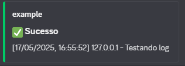
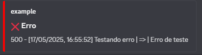
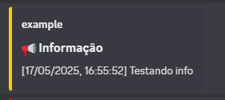
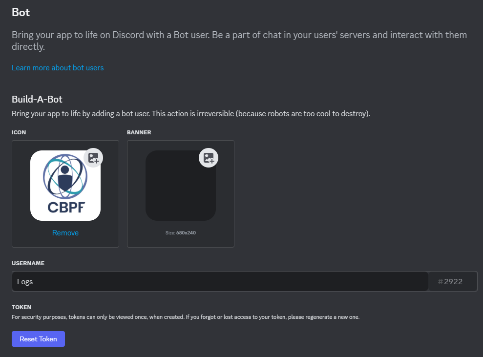
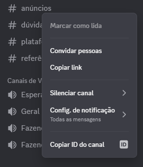

# 🤖 Discord Logging Bot

This project is a **TypeScript bot using Nitro and Discord.js** that receives HTTP requests and sends stylized logs to a specific channel in your Discord server.

---

## 🚀 How it works

The bot runs a lightweight HTTP server using **Nitro**, listening for `POST` requests. When it receives data, it formats the message as a clean Discord `Embed` and sends it to the specified channel via `CHANNEL_ID`.

Perfect for logging messages from your systems directly into Discord — **without webhook rate-limit issues** like `429 Too Many Requests`.

---

## 📸 Preview

👉 **Success log example:**

  

👉 **Error log example:**

  

👉 **Info log example:**

  

---

## 🔐 How to get your DISCORD_TOKEN

1. Go to the [Discord Developer Portal](https://discord.com/developers/applications)
2. Click **"New Application"** and name your bot
3. Go to the **"Bot"** tab in the left sidebar
4. Click **"Add Bot"**, then confirm
5. Click **"Reset Token"** and copy the generated token
6. Paste it into `.env` as `DISCORD_TOKEN`

📸 Example:



---

## 🔎 How to get the CHANNEL_ID

1. In Discord, go to **User Settings > Advanced**
2. Enable **Developer Mode**
3. Right-click on the target channel
4. Click **"Copy ID"**

📸 Example:

  

---

## 🛠️ Installation & Running

```bash
pnpm install

pnpm dev       # development mode
pnpm build     # production build
pnpm preview   # run built version
```

> ✅ For production use, run the bot with `pm2` in **fork mode**.

---

## 🌐 Listening port

By default, Nitro picks an available port like `3000` or `3001`.

To force the bot to use a specific port:

```bash
NITRO_PORT=3001 pnpm preview
```

---

## 📤 Sending logs to the bot

Send a `POST` request to the bot’s URL (e.g. `http://localhost:3001`) with a JSON body:

```json
{
  "sistema": "Reservation System",
  "mensagem": "User Rafael logged in",
  "tipo": "success",
  "ip": "192.168.0.1",
  "status": 200,
  "channelId": "2133213123211223"
}
```

- `tipo`: `"success"`, `"error"`, `"info"`
- `ip` and `status` are optional

---

## 🧪 Example using fetch (Nuxt or any Node app)

```ts
await fetch('http://localhost:3001', {
  method: 'POST',
  headers: { 'Content-Type': 'application/json' },
  body: JSON.stringify({
    sistema: 'Reservation System',
    mensagem: 'User Rafael logged in',
    tipo: 'success',
    ip: '127.0.0.1',
    channelId: '2133213123211223'
  })
})
```

---

## ✅ Why use this bot?

- ✅ Avoids **429 Too Many Requests** errors
- ✅ Supports multiple systems and clustered apps
- ✅ Sends clean, readable Discord embeds
- ✅ Lightweight using Nitro (no Express needed)
- ✅ Easy to extend with authentication or more features

---

## 📝 License

MIT – [Rafael Curi](https://curi.dev.br)